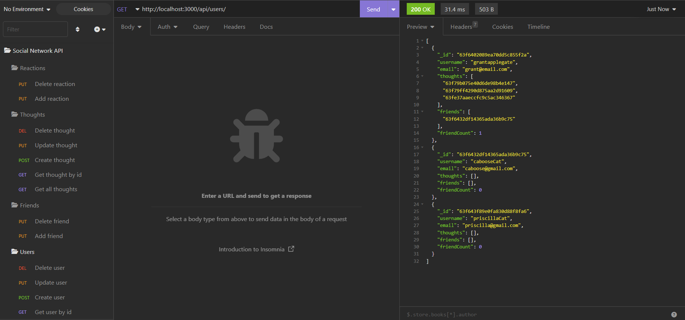

# Social Network API

## Description

This app is an API for an example social networking website where users can add friends, share thoughts, and react to friend's thoughts.

The socal network API project intoduced us to MongoDB, a popular database choice due to its flexibility with unstructured data.

## Installation

Download the repo to your device. You will also need to have MongoDB and Insomnia installed, and MongoDB Compass is recommended. In the terminal, navigate to the repo and type 'npm i'. You're now ready to run the app!

## Usage

Use Insomnia to test the GET, POST, PUT, and delete routes. You may also use Compass to see the database change with each request.

For a walkthrough video, [click here](https://drive.google.com/file/d/1u0nW_swDfgtv44YCqn5tzZ-7l3vFpLEW/view).
